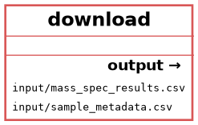

# Mass Spectrometry Pipeline

# Визуализации графов

# 1. Граф правил (Rule Graph)

# 2. Граф файлов (File Graph)

#  Запуск

# 1. Собрать Docker образ
docker build -t mass_spec:latest .

# 2. Запустить pipeline
snakemake --cores 1

# 3. Создать графы
snakemake --rulegraph | dot -Tpng > rulegraph.png
snakemake --filegraph | dot -Tpng > filegraph.png